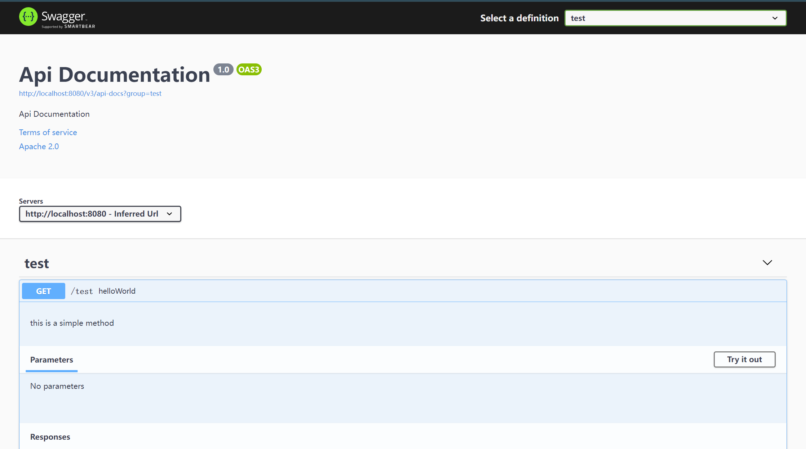

# 问题记录

Failed to start bean 'documentationPluginsBootstrapper';

```java
    @Bean
    @Primary
    public WebMvcRequestHandlerProvider webMvcRequestHandlerProvider(Optional<ServletContext> servletContext,
                                                                     HandlerMethodResolver methodResolver,
                                                                     List<RequestMappingInfoHandlerMapping> handlerMappings){
        List<RequestMappingInfoHandlerMapping> collect = handlerMappings.stream()
                .filter(mapping -> mapping.getPatternParser() == null)
                .collect(Collectors.toList());
        return new WebMvcRequestHandlerProvider(servletContext,methodResolver,collect);
    }

```

同时在application里配置
```properties
spring.main.allow-bean-definition-overriding=true
```


或者修改spring的path策略

```properties
spring.mvc.pathmatch.matching-strategy=ant_path_matcher
```
就不用返回 WebMvcRequestHandlerProvider 了

# 访问
http://localhost:8080/swagger-ui/

样例如下
